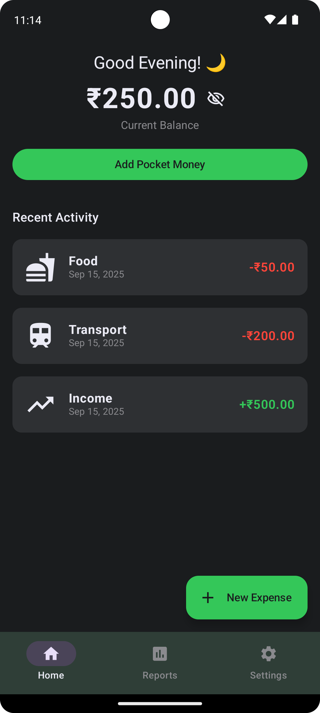
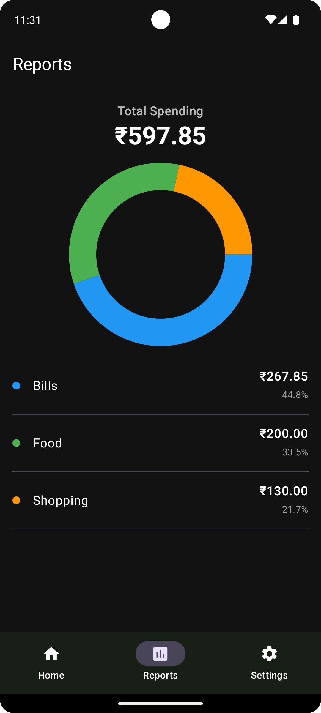

# Mulah Manage 💸

  

A simple, modern expense tracker Android app designed specifically for students to manage their pocket money and daily expenses (`kharcha`) without the complexity of traditional finance apps.

This project was built from the ground up as a learning experience in modern Android development.

## Screenshots

| Dashboard                               | Reports                                   |
| --------------------------------------- | ----------------------------------------- |
|  |  |

## ✨ Features (As of September 16, 2025)

This app is currently under development, but the core functionality is in place.

* **Track Income & Expenses:** Easily add money received or expenses made.
* **Live Dashboard:** See your current balance and a "Safe to Spend Today" calculation at a glance.
* **Transaction History:** A clear, chronological list of all your entries on the main screen.
* **Swipe to Delete:** Intuitively delete transactions by swiping them away.
* **Spending Reports:** A dedicated screen with an animated pie chart that breaks down your spending by category.
* **Settings & Data Management:**
    * Export all your transaction data to a `.csv` file.
    * Erase all app data to start fresh.
* **Modern UI:** A sleek, dark-mode UI built entirely with Jetpack Compose.
* **Edit Transaction:** Easily edit any transaction by long-pressing on it.

## 🚀 Roadmap (Future Features)

The following features are planned for future development:

* [ ] **Advanced Filtering:** Filter the transaction list and reports by date (week, month, custom range).
* [ ] **Savings Goals:** Set and track savings goals (e.g., "Save for a trip").
* [ ] **Cloud Sync:** Option to back up and sync data across devices using Firebase.
* [ ] **Budgeting:** Set monthly or weekly budgets for different categories.
* [ ] **Notifications:** Reminders to log expenses or warnings when nearing a budget limit.

## 🛠️ Tech Stack

* **Language:** 100% [Kotlin](https://kotlinlang.org/)
* **UI:** [Jetpack Compose](https://developer.android.com/jetpack/compose)
* **Architecture:** MVVM (Model-View-ViewModel)
* **Asynchronous:** Kotlin Coroutines & Flow
* **Database:** [Room](https://developer.android.com/jetpack/androidx/releases/room) for local persistence
* **Navigation:** [Jetpack Navigation Compose](https://developer.android.com/jetpack/compose/navigation)

## ⚙️ Setup

To build and run this project:
1.  Clone the repository: `git clone https://github.com/your-username/mulah-manage.git`
2.  Open the project in the latest version of Android Studio.
3.  Build the project and run it on an emulator or a physical device.
